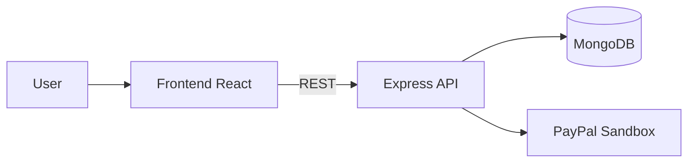

# Индексация и онбординг на чужой репо — M2 best practices

> **Для чего этот файл:** ты открыл незнакомый репозиторий. Задача — за час понять, что это, как устроено, где что лежит, и где потенциальные проблемы. Ниже — проверенные паттерны для разных AI-IDE.
>
> **Формат:** читаешь нужный раздел, берёшь промпт, копипастишь в свою IDE, получаешь результат. Каждый промпт проверен в 2025-2026 на реальных репах.
> **Дата:** 2026-04-22.

---

## 0. Общий принцип

У всех современных AI-IDE есть два режима исследования:

| Режим | Где работает | Плюс | Минус |
|---|---|---|---|
| **RAG / индекс** | Cursor `@Codebase`, Windsurf, Continue | Быстро, семантический поиск | Устаревает; нужно дождаться индексации; ошибается на длинных causal цепочках |
| **Agentic search** (grep + read) | Claude Code, Codex CLI, OpenCode | Всегда свежий, точный, видит runtime | Медленнее, сжигает токены |

**Лайфхак:** для исследования не смешивайте генерацию кода и изучение. Сначала Plan Mode / read-only exploration → потом правки.

---

## 1. Канонический workflow (из Anthropic-official гайда)

```
/init                              ← сгенерировать стартовый CLAUDE.md
   ↓
Plan Mode (Shift+Tab в CC)         ← блокируем edit-операции
   ↓
«Explain the architecture» prompt  ← см. §2
   ↓
«Trace specific feature» prompt    ← см. §3
   ↓
Обновить CLAUDE.md под то,         ← добавить найденные конвенции
что нашли
   ↓
Выйти из Plan Mode → Accept → Execute ← первая реальная правка
```

---

## 2. Explain the architecture (начало исследования)

**Цель:** получить ментальную карту проекта за 5-10 минут.

### Promt A — широкий обзор

```
Ты — опытный software archaeologist. Просканируй этот репозиторий (read-only).
Я открыл его впервые.

Задача: выдать мне ментальную карту за 5 минут.

Сгенерируй в таком порядке:
1. Identity Card — таблица (язык, фреймворк, ~LOC, возраст проекта по commit datам, последний active period)
2. Architecture Map — mermaid flowchart:
   entry points → главные модули → хранилища данных → внешние сервисы
3. Health Report — таблица (hotspots по churn, risky dependencies, test coverage gaps, naming drift)
4. Codebase Story — 2 абзаца «как эволюционировал этот код» (на основе commit log)

Правила:
- Не рефакторь и не переписывай ничего
- Если не уверен — пиши «похоже на X, нужна проверка»
- Если репо большой и где-то не смог пройти — скажи какие зоны пропустил

Используй реальные пути файлов как node labels в mermaid.
Не пиши line numbers (ты их галлюцинируешь).
```

**Output:** готовый markdown-блок для `docs/architecture.md` (с Mermaid-диаграммой) + health report.

---

## 3. Trace a specific feature (глубокое исследование)

**Цель:** понять один конкретный flow целиком — как именно работает одна user-visible фича.

### Promt B — трассировка фичи

```
Проследи user flow «<выбранный сценарий>» — пример: «user places an order» в e-commerce, «user sends a tweet» в соцсети.

Для этого flow покажи:
1. Entry point (какой route / handler принимает запрос)
2. Transport layer (middleware / validation / парсинг)
3. Business logic (где реальная логика — controller/service/use-case)
4. Persistence (куда пишет в БД, какие модели, какие миграции)
5. Response/UI update (где возвращается ответ фронту)
6. Side effects (emails, webhooks, логи, events)

Формат ответа: markdown с file:line refs (но только функции, без line numbers — их не угадаешь).

В конце — 3 места, где логика «хрупкая» (без валидации / без обработки ошибок / с hardcoded значениями).
```

### Promt C — Codex-style onboarding checklist (OpenAI official)

```
Покажи мне этот проект по шагам:
1. Дай relevant files/directories/feature area — что самое важное.
2. Trace request flow и объясни какие модули отвечают за business logic vs transport vs persistence vs UI.
3. Где происходит валидация, где side effects, где state transitions?
4. В конце: какие файлы мне читать следующими и где рискованные места?
```

---

## 4. Cursor-специфика (для тех, кто на Cursor)

Cursor использует RAG-индексацию. Рабочий флоу для большого repo (из blog post markaicode):

1. `tree -L 2 > structure.txt` в терминале → загружаем в чат как `@structure.txt`
2. Промпт: «Дай мне обзор этого repo через structure. Выдели 5 главных директорий, опиши назначение каждой одним абзацем».
3. Выбираем одну фичу: «Trace the user registration flow».
4. Загружаем в чат 3-5 ключевых файлов (auth controller, service, model) через `@file`.
5. Финальный промпт: «Contribution roadmap: если я захочу добавить 2FA — какие файлы поменяются?»

**Команды Cursor для ориентации:**
- `@Codebase` — семантический поиск по всему репо.
- `@Folders` — ограничить контекст конкретной папкой.
- `@file` — явно прикрепить файл в контекст (не надеясь на индекс).

---

## 5. Claude Code-специфика

Claude Code **не использует индекс** — работает через grep/read примитивы. Плюс: всегда свежий. Минус: если не знаешь, куда смотреть — сжигает токены.

**Рабочий флоу:**
1. `/init` — сгенерировать базовый `CLAUDE.md`. Отредактировать руками (добавить 3-5 unwritten rules).
2. Plan Mode (`Shift+Tab`) → промпт А (§2).
3. Параллельный Explore agent для больших репо: `I want to explore the architecture of this repo — launch Explore subagent with read-only scope`.
4. После первых ответов — попросить уточнить сомнительные куски.

**Лимиты:** держи CLAUDE.md ≤150 строк (hard recommendation Anthropic). Больше — context rot, AI начинает игнорировать части.

---

## 6. Windsurf / Codex CLI / другие

- **Windsurf:** Cascade Memories — после ручного "remember this" auto-сохраняется между сессиями.
- **Codex CLI:** тот же agentic подход что у Claude Code; используй checklist из §3 (Promt C).
- **Gemini CLI:** 1M context → можно скормить весь проект (CAG вместо RAG) и задать вопрос. Подходит для small/mid проектов.

---

## 7. Mermaid-диаграммы на GitHub

GitHub рендерит Mermaid **прямо в markdown** — это делает документацию «живой».

Блок выглядит так:

````markdown

````

Сохрани файл на GitHub и открой в браузере → увидишь нарисованную схему.

**Промпт для генерации:**

```
Сгенерируй Mermaid C4-container диаграмму для этого кодбейса:
- Все entry points (controllers, handlers, CLI commands)
- Хранилища данных (Postgres, MongoDB, Redis, S3...)
- Внешние сервисы (PayPal, Stripe, SMTP...)
- Покажи data flow для сценария "<конкретный use-case>"

Используй subgraph для Frontend / Backend / Data Layer / External.
Реальные пути файлов как названия нод.
Не пиши line numbers (галлюцинируешь).
```

---

## 8. Findings — как искать реальные баги через AI

**Зачем:** просто "AI, найди баги" — даёт generic ответ. Нужна структура.

### Promt D — structured bug-hunt

```
Действуй как bashкопательный security/quality reviewer этого репо. Найди:

1. HOTSPOTS — файлы с самым сложным кодом (высокий cyclomatic complexity, >50 строк функции, вложенные callbacks/promises).
2. EDGE CASES — места где нет проверки на empty input / null / undefined / невалидный тип.
3. OUTDATED DEPS — зависимости с major-версией N, когда актуальная N+3+ (Mongoose 5 → 8, React 17 → 19, Node 14 → 20).
4. HARDCODED VALUES — магические числа, захардкоженные URLы, секреты в коде.
5. DEAD CODE — неиспользуемые экспорты, закомментированные блоки старше 6 месяцев.

Для каждой находки:
- Где (file:function — без line numbers)
- Что именно не так (1-2 предложения)
- Уровень риска: 🔴 critical / 🟡 medium / 🟢 cosmetic
- Как бы ты исправил (1 предложение, НЕ исправляй сам)

Выдай топ-5 находок, сортированных по риску. Формат — markdown-таблица.
```

**Что делать с выводом:**
1. Сохрани в `FINDINGS.md` в корень репо.
2. Выбери **1 находку** — лучше 🔴 или 🟡.
3. Попроси AI её **исправить** в отдельном коммите: «Fix finding #N from FINDINGS.md. Сделай PR-size изменение, добавь short rationale в commit message.»
4. В `FINDINGS.md` поставь ✅ рядом с исправленным, с ссылкой на commit.

### Пример формата FINDINGS.md

```markdown
# FINDINGS — proshop_mern

| # | Риск | Где | Что | Как фиксить | Статус |
|---|------|-----|-----|-------------|--------|
| 1 | 🔴 | backend/controllers/orderController.js::calcPrices | при пустых orderItems возвращает NaN | добавить early-return для empty array | ✅ [commit a3f2c1](...) |
| 2 | 🟡 | frontend/screens/CartScreen.jsx | localStorage использован без try/catch (Safari private mode крашит) | обернуть в try/catch + fallback | 🔴 не сделано |
| 3 | 🟡 | package.json | mongoose 5.x — 4 major позади | npm install mongoose@8 + test migration | 🔴 не сделано |
```

---

## 9. Chekpoint

Перед тем как считать онбординг завершённым, убедись:

- [ ] Есть `CLAUDE.md` / `AGENTS.md` / `.cursor/rules/` под твою IDE с минимум 4 секциями
- [ ] Есть `docs/architecture.md` или обновлённый README с mermaid или текстовым описанием архитектуры
- [ ] Есть `FINDINGS.md` с минимум 3 находками и 1 исправленной
- [ ] В `.gitignore` точно НЕТ секретов в репо (`.env`, ключи)
- [ ] Ты можешь за 2 минуты показать коллеге «вот это проект делает X, entry point тут, БД такая, внешние сервисы такие»

Если все ✅ — ты готов к M3.

---

*Источники (верифицированные 2026-04): cursor.com/docs, docs.anthropic.com (Claude Code), OpenAI Codex onboarding guide, markaicode, DeveloperToolkit.ai.*
