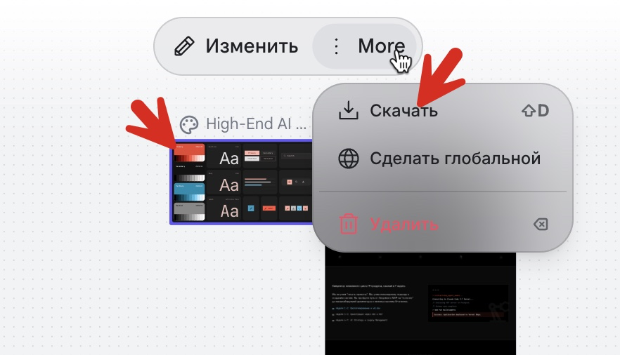

# Как экспортнуть `DESIGN.md` из Google Stitch

`DESIGN.md` — открытый формат Google для описания дизайн-системы (цвета, типографика, компоненты, layout-правила) в виде агенто-читаемого markdown-файла. С апреля 2026 спецификация открыта, поэтому файл можно скармливать любому coding-агенту (Claude Code, Cursor, Copilot) как «source of truth» для генерации UI.

Ниже — три способа получить `DESIGN.md` из своего Stitch-проекта.

---

## Способ 1. Через UI Stitch (самый простой)

1. Открой [stitch.withgoogle.com](https://stitch.withgoogle.com) → свой проект.
2. На канвасе кликни по карточке **Design System** (та, где превью с цветами / типографикой / компонентами — обычно с подписью «High-End AI ...» или другим именем твоей системы). Карточка должна стать выделенной (синяя обводка).
3. В верхнем плавающем тулбаре над карточкой нажми **⋮ More** (три точки рядом с кнопкой «Изменить»).
4. В выпадающем меню выбери **↓ Скачать** (горячая клавиша `⇧D` / `Shift+D`).
5. Stitch скачает `DESIGN.md` (или ZIP с ним и сопутствующими ассетами) себе в Downloads.



> Кнопка **Сделать глобальной** в этом же меню — отдельная штука: она привязывает дизайн-систему ко всему аккаунту, чтобы переиспользовать в новых проектах. Для экспорта файла она не нужна.

В том же контекстном меню (через **More** на других карточках) можно скачать:
- **Figma-ready file** — для дизайнеров, продолжающих работу в Figma.
- **ZIP с HTML/CSS** — локальная папка со всеми ассетами и HTML-файлом.
- **Copy code to clipboard** — мгновенная вставка кода в редактор/браузер.

---

## Способ 2. Через Stitch MCP + skill `design-md` (для агентов)

Если хочется генерить `DESIGN.md` прямо из Claude Code / Cursor без захода в UI:

```bash
npx skills add google-labs-code/stitch-skills --skill design-md --global
```

Потом в чате с агентом:

> «Analyze my [project name] project and generate a comprehensive DESIGN.md file documenting the design system.»

Что произойдёт под капотом:
1. Skill дёрнет Stitch MCP: `list_projects` → `list_screens` → `get_screen` → `get_project`.
2. Скачает HTML и скриншоты экранов через `htmlCode.downloadUrl` / `screenshot.downloadUrl`.
3. Распарсит Tailwind-классы и кастомные CSS-переменные.
4. Соберёт `DESIGN.md` по канонической структуре:
   - `1. Visual Theme & Atmosphere`
   - `2. Color Palette & Roles` (имя + hex + функциональная роль)
   - `3. Typography Rules`
   - `4. Component Stylings` (Buttons / Cards / Inputs)
   - `5. Layout Principles`

Репозиторий со скиллом: [google-labs-code/stitch-skills](https://github.com/google-labs-code/stitch-skills/tree/main/skills/design-md).

---

## Способ 3. Конвертация уже готового `DESIGN.md` в другие форматы

Когда `DESIGN.md` уже есть, его можно экспортнуть в Tailwind config или W3C DTCG-токены через официальную CLI:

```bash
# В Tailwind theme JSON
npx @google/design.md export --format tailwind DESIGN.md > tailwind.theme.json

# В W3C Design Tokens Community Group (DTCG) — мост к Figma Variables / Storybook
npx @google/design.md export --format dtcg DESIGN.md > tokens.json
```

Дополнительно у CLI есть команды:
- `lint` — валидация + WCAG-проверка контраста.
- `diff` — сравнение версий `DESIGN.md`.
- `spec` — инжект спецификации в промпт агента.

Установка не нужна — всё через `npx`.

---

## Зачем это в продуктовом флоу

Pipeline получается такой:

```
описать цель → Stitch генерит UI → экспорт DESIGN.md →
coding-агент читает DESIGN.md при сборке кода → код едет в репо
```

Это убирает классический цикл «Figma export → handoff → разработчик неправильно интерпретировал». Агент знает, **зачем** существует каждый цвет (роль primary/surface/danger), и может валидировать свои решения против WCAG автоматически.

---

## Источники

- [blog.google — Stitch app's DESIGN.md format is now open-source](https://blog.google/innovation-and-ai/models-and-research/google-labs/stitch-design-md/) (анонс открытия спецификации, 2026-04-21).
- [aifor.dev/tools/google-stitch](https://aifor.dev/tools/google-stitch) — обзор всех export-опций Stitch.
- [mindwiredai.com — What Is DESIGN.md?](https://mindwiredai.com/2026/04/23/design-md-is-now-open-source-googles-new-file-format-that-makes-ai-build-your-brand-correctly/) — разбор CLI-команд `export` / `lint` / `diff`.
- [GitHub: google-labs-code/stitch-skills](https://github.com/google-labs-code/stitch-skills/tree/main/skills/design-md) — официальный skill для агентов.
- [YouTube: How to Export Designs from Google Stitch](https://www.youtube.com/watch?v=RPrddiU9sWQ) — короткий UI-walkthrough.
